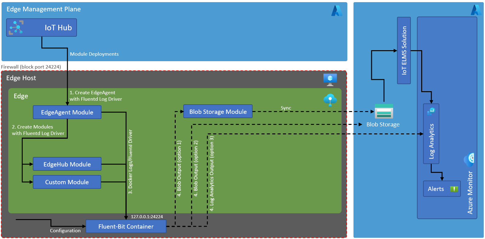
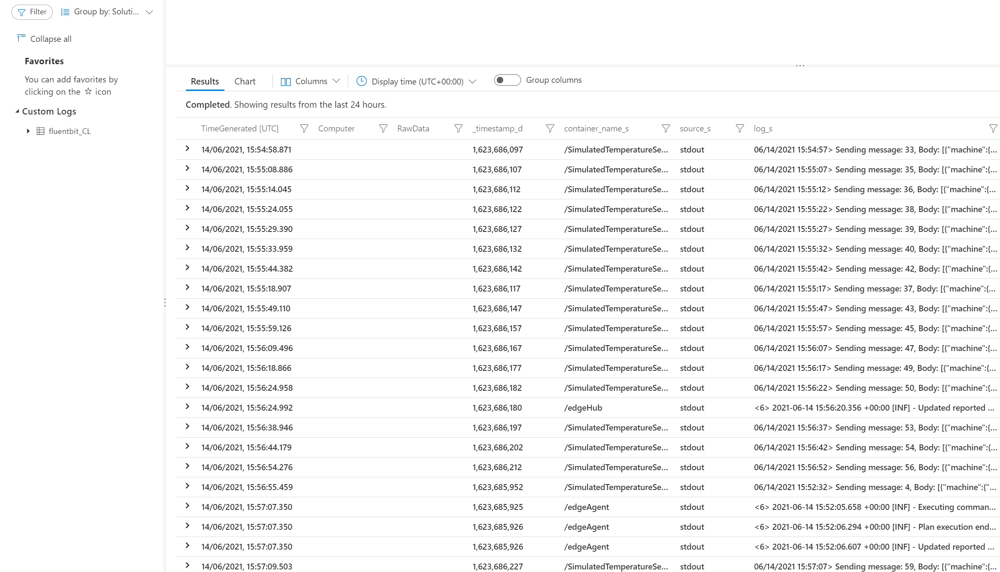

# IoT Edge Logging via Docker Log Driver (Push Model)

In this example we demonstrate how you can receive logs from modules (containers) running at IoT Edge in a push model in comparison to a pull model which makes use of edgeAgent [direct methods](https://docs.microsoft.com/en-us/azure/iot-edge/how-to-retrieve-iot-edge-logs?view=iotedge-2020-11).
This design allows you to receive logs from modules at the edge and push them to the configured sink (e.g. log analytics, blob store) of the log processor/forwarder, as long as that sink is available.

One of the use cases for using this approach is offline mode where edge is not always connected to IoTHub in the cloud. Using edge [blob storage module as sink](https://docs.fluentbit.io/manual/pipeline/outputs/azure_blob) we can store and use logs locally at edge. There are two main reasons for this use case, which are described below:

1. Local monitoring of critical infrastructure at the edge (e.g. factory floor) when intermittent IoT Hub connectivity issues occur.
2. Ensuring continuous log feed in cloud is available in case of long connectivity issues.

## Solution

Docker has multiple logging mechanisms to allow monitoring of the containers, these mechanisms are implemented as [logging driver](https://docs.docker.com/config/containers/logging/configure/). Docker supports a few logging drivers out of the box which can be used to channel logs from containers readily. Example of these log drivers include json-file (default), local file, AWS Cloud Watch, Google Cloud Logging and Fluentd. *While file based log drivers could be used as well in the solution, Docker warns you to use this approach (see variants section below).*

In this solution we make use of Fluentd log driver, in particular a sub project of Fluentd called [Fluent-Bit](https://fluentbit.io/) which is developed for *high performance and low resource footprint*. Fluent Bit is an open source Log Processor and Forwarder which allows you to collect any data like metrics and logs from different sources, enrich them with filters and send them to multiple destinations. Fluent Bit is also a CNCF (Cloud Native Computing Foundation) subproject under the umbrella of Fluentd.

Following design explains the overall architecture of the solution:

So how does this work? To understand the solution, we have a consider following two main aspects of the solution:

### Setup/Configuration

#### Logging Setup

In our case logging infrastructure mainly consist of log processor/forwarder (Fluent-Bit), Log analytics workspace and optionally a blob storage module with cloud blob storage.
Fluent-Bit is deployed as [container](https://hub.docker.com/r/fluent/fluent-bit/) at the host level i.e. not managed by IoT Edge management plane, it is part of the initial edge deployment/setup. Deployment of Log Analytics and optional cloud blob storage will follow the same initial setup model.
Please note we are unable run Fluent-Bit as a module at edge if we want to collect logs from edgeAgent module. This is because when edgeAgent module is started by the runtime it looks for the Fluentd endpoint which is not available at this stage as Fluent-Bit module is not downloaded and started by edgeAgent yet so edgeAgent module fails to start as well.

#### Logging Configuration

Logging setup above would prepare the environment to receive the logs emitted by modules, which leads us to the next step of configuring the solution which is to do with emission/pushing logs to the logging infrastructure.
To push the logs from modules to Fluentd based log processor (Fluent-Bit), we need to configure modules/containers to have a [fluentd log driver](https://docs.docker.com/config/containers/logging/fluentd/) configured. We can either configure this logging driver at the time of creation of each module individually (via createOptions in deployment manifest) or at the Docker daemon level by updated daemon.json file on the host machine. Once configured, Docker will start to send the logs to the fluentd endpoint configured(defaults to 127.0.0.1:24224).

### Here are some key benefits of using this approach

1. It allows you to receive logs from Docker daemon without connecting to Docker socket or requiring privilege access, reducing surface attack area for edge.
2. It allows you either use prebuilt/3rd party log processors (e.g. [Fluent-Bit](https://fluentbit.io/)) or create your own container/module following [Docker log driver API model](https://docs.docker.com/engine/extend/plugins_logging/).
3. It allows you to store logs via already available sinks (e.g. storage account connector), to the edge storage account for local processing or Log Analytics service directly.

## Solution Deployment

Follow the steps here on Ubuntu/Linux to deploy the solution (with Log Analytics sink) along with all dependencies in Azure:

1. Install jq via: sudo apt-get install jq
2. Clone the repo using: clone git@github.com:suneetnangia/iot-edge-logging-fluentd.git
3. Go to directory: iot-edge-logging-fluentd/deploy
4. Execute: ./deploy.sh "[new resource group name]" "[ssh public key]"

Example of cmd line is given here:

./deploy.sh "loggingRG" "ssh-rsa AAAAB3NzaC1yc2EACCCDAQABAAABgQD1KWmN/yqr9hBmaS4zOHfMqrrKxWWJxHs+3W1Gt5PqGoS8zRC633dMwiOxsS0uSh+EHlVDxdzwLWv11uyd6PMcNWp2L3D3mL7vB8M+6vajLceY+MKULa8r2PrWxzaCCBldXcLhD5Uzap+8z9CI4vqO4C1lR9N0O6gSfn4TO/FqtaraWNqwMP9ug6feMfXDCZ6tCkwihmPAmYzLCrstDYH98L0DiCmMQGsFe3g+RI8jGrs1dglWoCnrLeo3vzIvOBbw8HJmtWRfbe0iQYRes1b3N9QSDXBWLUalaNMJ3HkSAS2RYQIvyU9krqxb0wjBHHwTX4OX9Wn9fCd2Ah5WLcAxBxppYyuiLhgycRqUgQBa7svf00EH9E3gndTUoCRg4fx5Q8BhE92BjwaXvvuswE3FpWwp10cCTjYgjjuUC0qqPhMEE0SNqBqzLSZwjTCKSK+9fPN7SIwc9dzTBraAIGBAilzF7csFjiuaxxQDpTGgAI2M+6658VJtOVZ62vU4VWU= suneet.nangia@mail.com"

Once deployed, you should see the logs starting to appear in Log Analytics like below:

## Nuances

Here are some of the nuances you should be aware of when considering this solution.

1. Fluent-Bit log processor is not part of the edge management plane, that is, it is not deployed via IoT Hub. Instead, it is deployed as part of IoT Edge setup, which lends itself to align well with offline mode. Please see Logging Setup section above for more details.
2. Port exposed by Fluent-Bit module/container (default 24224) could be of security concern, to mitigate this risk configure host machine to block this port outside of the host.

## Variants

1. We can change the Docker logging driver to use Docker's default json-file driver which will allow all modules including edgeAgent to start without log processor being deployed beforehand. Fluent-Bit can then use tail input plugin to scrape the logs. Primary concern with approach here is that json-file/local-file log driver documentation categorically says *"These files are designed to be exclusively accessed by the Docker daemon. Interacting with these files with external tools may interfere with Docker’s logging system and result in unexpected behavior, and should be avoided."*

## Other Solutions and Options

1. Using pull model approach, you can use a direct method on Edge Agent system module, it does require edge to be connected to IoT Hub as the direct method invocation for Edge Agent can only happen via service side. An implementation of this Edge Logging and Monitoring Soliution (ELMS) is [available](https://github.com/Azure-Samples/iotedge-logging-and-monitoring-solution) in the official Azure samples repo which also covers Premetheus based metrics collection.
2. We have a metrics collector edge module available as well which can send metrics to either IoTHub or Log Analytics worksapce directly, this module can be either used independently or as part of ELMS solution mentioned above.
3. You can use prebuilt OMS container and deploy it at edge to connect to Docker socket to stream the logs in and then store those logs to the data sink of your choice. This solution however has an inherent security implications, that is, once you connect to Docker socket you [effectively have root access](https://docs.docker.com/engine/install/linux-postinstall/) to the host machine as Docker engine configured by edge installation by default runs with a root security context. This may result in an increased surface attack area for the hosts machines in the edge network (OT network) where often security is not mature enough.
